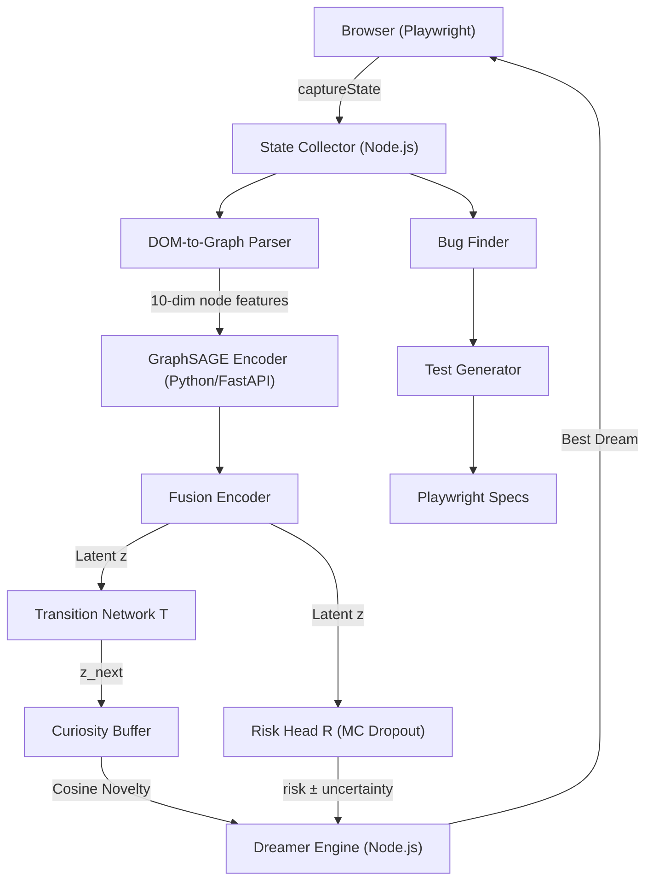

# Architecture Assessment: SimTest

## Project Purpose
SimTest is a world-model-based autonomous web testing framework. It uses a combination of BFS state-space exploration via Playwright and a multi-agent LLM system to navigate web applications, detect bugs, and generate test specifications. It features a neural microservice (PyTorch) using GraphSAGE and a Latent Memory Buffer to predict next-state transitions and provide uncertainty-aware risk analysis via Monte Carlo Dropout.

## Architecture Diagram

## Tech Stack
* **Core Engine:** Node.js, JavaScript (ESM & CommonJS)
* **Browser Automation:** Playwright
* **DOM Parsing:** Cheerio
* **Graph Algorithms:** `@dagrejs/graphlib`
* **LLM Integration:** `@google/generative-ai` (Gemini)
* **Neural Microservice:** Python 3.10, FastAPI, Uvicorn, PyTorch, PyTorch Geometric
* **Demo Application:** React 18, Vite, React Router
* **Visual Dashboard:** Vanilla HTML/CSS/JS

## Deployment Process
* Dockerfile provided for `simtest-core` (`node:20-bullseye`).
* CI/CD via GitHub Actions (`.github/workflows/simtest-ci.yml`), which automatically runs the test suite and posts a PR summary.

## External Services & APIs
* **Google Gemini API:** For LLM-based action generation.
* **Neural World Model API:** Runs locally on port 8000.

## Database Schema
* No persistent database. State transitions are logged to `transitions-dataset.jsonl`. Latent memory buffer is held in memory (`deque(maxlen=10000)`).
